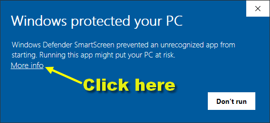
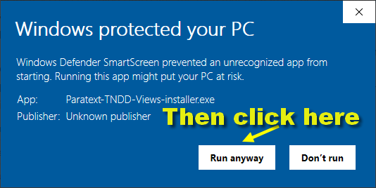
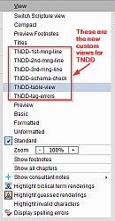
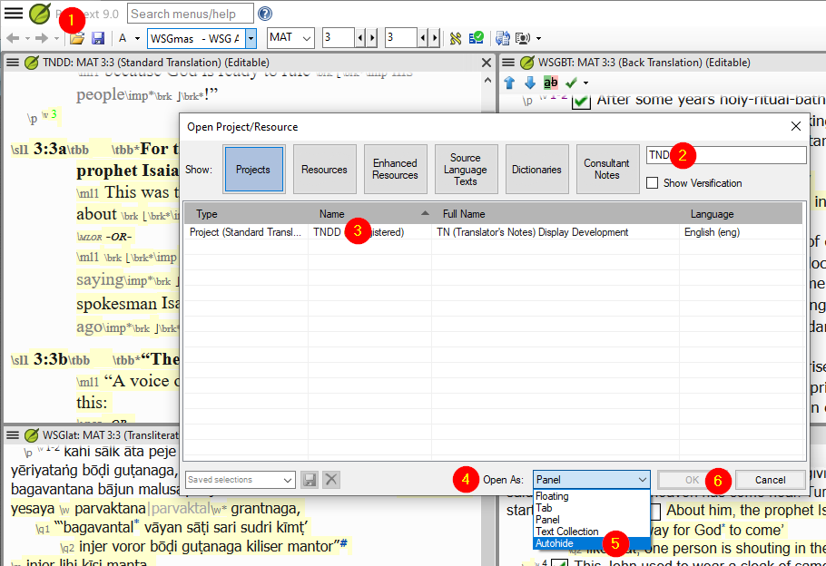

# Paratext TNDD Views release

This additional tool for Paratext is designed to help content creators and checkers to VIEW (but not edit) the TNDD Paratext Project data in different ways. There are 5 views as explained below: 

## Views

- **TNDD-table view** -- This displays up to four columns. The source language in the left most column, then the first meaning from the \ml1, then the second meaning and finally the third meaning.
- **TNDD-1st-mng-line** -- This displays the 1st meaning line preceded by the verse reference. Each verse starts on a new line.
- **TNDD-2nd-mng-line** -- This displays the 2nd meaning line and is similar to the 1st line, but if there no data for a second meaning (\ml1) line the then that data from the 1st meaning is displayed in (( )) with text in a red-brown color.
- **TNDD-3rd-mng-line** -- This displays the 3rd meaning line and is similar to the 1st and 2nd line, but if there no data for a third meaning (\ml1) line the then that data is displayed in (( with a brown color if it comes from the 2nd meaning and a red-brown if it come from he 1st first line.
- **TNDD-tag-errors** -- This aids content creators to see that there is a markup error that PT does not catch. This view may still have some false labeling.
- **TNDD-word-count-1st-mng-line** - This counts words per sentence. It marks sentence counts of more than 17 in orange and more than 30 words in tomato-red.
- **TNDD-word-count-2nd-mng-line** - This counts words per sentence. It marks sentence counts of more than 17 in orange and more than 30 words in tomato-red.

## How to Install these Views for Paratext

### Option 1: Use the Paratext-TNDD-Views-installer.exe 
- Download [Paratext-TNDD-Views-installer.exe](https://github.com/SILAsiaPub/PT-Views/releases/download/2020-07-15/Paratext-TNDD-View-installer.exe)
- The unsigned installer may cause Windows (or your Anti-Virus program) to object, but Keep the downloaded file anyway:

- When you eventually run the .exe installer, you may see further warnings - and will need to click the More info link:

- And then you can select the option to Run anyway

- The installer should now run and you will need to follow the usual steps to Install the Paratext Views
- You might need to Restart Paratext in order to use the new views

### Option 2: Run a script to install
- Download [TNDD-Views.zip](https://github.com/SILAsiaPub/PT-Views/releases/download/2020-05-01/TNDD-Views.zip) 
- Select the option "Show in folder", and then in your Downloads folder, right click on the Views.zip file
- Then select your preferred UNZIP tool to Extract all... (preferably to a new folder called Views)
   (if given the option, ensure that "Show extracted files when complete" is checked).
- Double click on the **install_Paratext_TNDD_Views.cmd**
  - If all went well the black box dissappears. If not it will stay and give failure info
- Restart or Start Paratext and the new views should be available in the Ctrl+E menu or the projects hamburger menu.

## Using the TNDD Views within Paratext

- If the installation was successful, the new views should be available as shown below:
	via the Ctrl+E popup menu:         or via the project's View menu:     
- Note that you cannot edit the text in *any* of these VIEWS - it is purely an aid for reading and checking the text (one meaning line at a time) without the clutter of markers.

- If you are using Paratext 9, then it is highly recommended to open an additional TNDD window as an Autohide window:

- This will enable you to keep your normal workspace uncluttered, but the Table view will be easy to access from the right-hand column:

### Hiding TNDD Views
- In Paratext click on the hamburger icon in any project.
- In the **Tools** menu hover over or click on **Custom tools**
- In  **Custom tools** click on **Custom Views**
- Click on **Hide TNDD Views**
- Click the **OK** on the **Hide TNDD Views** dialog
- Restart Paratext

### Show TNDD Views tha were previously hidden
- In Paratext click on the hamburger icon in any project.
- In the **Tools** menu hover over or click on **Custom tools**
- In  **Custom tools** click on **Custom Views**
- Click on **Show TNDD Views**
- Click the **OK** on the **Show TNDD Views** dialog
- Restart Paratext

## Uninstall
- Just double click the **Uninstall-TNDD-Views.cmd** in original extracted View.zip folder.
- Or find in: **C:\Users\Public\TNdd-Views** folder, the file **Uninstall-TNDD-Views.cmd** and double click that 
- or You could just delete the Views folder if you only have TNDD views,
- or You could just delete the .xml files in the Views folder and those views would no longer appear,
- or you could delete all the files in the Views folder.
- also delete all files starting with TNDD from the **My Paratext 8(or 9) Projects\cms** folder if not using the uninstaller.

## There are three **Tools > Custom Tools > Custom Views**
- Hide TNDD Views 
- Show TNDD Views 
- Uninstall TNDD Views 

---
Credits: Concept by Mark Penny, Design and Programming by Ian McQuay

More details and further [updates](https://github.com/SILAsiaPub/PT-Views/releases) will be available at the [TNDD Views GitHub](https://github.com/SILAsiaPub/PT-Views/tree/master/TNDD) site. 